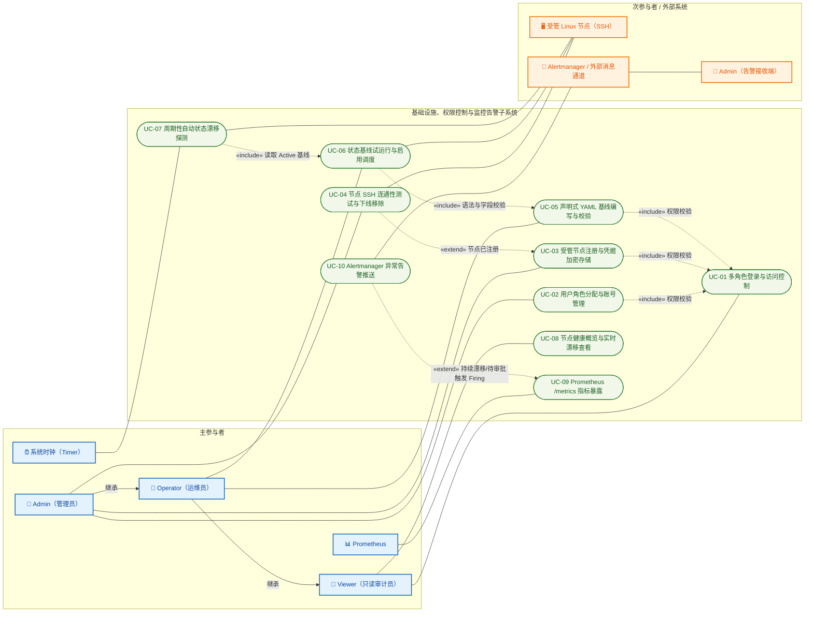

```mermaid
flowchart LR
    subgraph SG_P1["主参与者"]
        direction TB
        Admin["👤 Admin（管理员）"]
        Operator["👤 Operator（运维员）"]
        Viewer["👤 Viewer（只读审计员）"]
        Timer["⏰ 系统时钟（Timer）"]
        Prom["📊 Prometheus"]

        Admin -->|"继承"| Operator
        Operator -->|"继承"| Viewer
    end

    subgraph SG_S1["基础设施、权限控制与监控告警子系统"]
        direction TB
        UC01(["UC-01 多角色登录与访问控制"])
        UC02(["UC-02 用户角色分配与账号管理"])
        UC03(["UC-03 受管节点注册与凭据加密存储"])
        UC04(["UC-04 节点 SSH 连通性测试与下线移除"])
        UC05(["UC-05 声明式 YAML 基线编写与校验"])
        UC06(["UC-06 状态基线试运行与启用调度"])
        UC07(["UC-07 周期性自动状态漂移探测"])
        UC08(["UC-08 节点健康概览与实时漂移查看"])
        UC09(["UC-09 Prometheus /metrics 指标暴露"])
        UC10(["UC-10 Alertmanager 异常告警推送"])
    end

    subgraph SG_E1["次参与者 / 外部系统"]
        direction TB
        SSHNode["🖥️ 受管 Linux 节点（SSH）"]
        AlertMgr["🔔 Alertmanager / 外部消息通道"]
        AdminRecv["📱 Admin（告警接收端）"]
    end

    %% 主参与者关联
    Viewer --- UC01
    Viewer --- UC08

    Operator --- UC05
    Operator --- UC06

    Admin --- UC02
    Admin --- UC03
    Admin --- UC04

    Timer --- UC07
    Prom --- UC09

    %% 用例间关系
    UC02 -.->|"«include» 权限校验"| UC01
    UC03 -.->|"«include» 权限校验"| UC01
    UC05 -.->|"«include» 权限校验"| UC01
    UC06 -.->|"«include» 语法与字段校验"| UC05
    UC04 -.->|"«extend» 节点已注册"| UC03
    UC07 -.->|"«include» 读取 Active 基线"| UC06
    UC10 -.->|"«extend» 持续漂移/待审批触发 Firing"| UC09

    %% 次参与者关联
    UC04 --- SSHNode
    UC06 --- SSHNode
    UC07 --- SSHNode
    UC10 --- AlertMgr
    AlertMgr --- AdminRecv

    classDef primaryActor fill:#E3F2FD,stroke:#1565C0,stroke-width:2px,color:#0D47A1
    classDef secondaryActor fill:#FFF3E0,stroke:#EF6C00,stroke-width:2px,color:#E65100
    classDef usecase fill:#F1F8E9,stroke:#2E7D32,stroke-width:1.5px,color:#1B5E20

    class Admin,Operator,Viewer,Timer,Prom primaryActor
    class SSHNode,AlertMgr,AdminRecv secondaryActor
    class UC01,UC02,UC03,UC04,UC05,UC06,UC07,UC08,UC09,UC10 usecase
```
