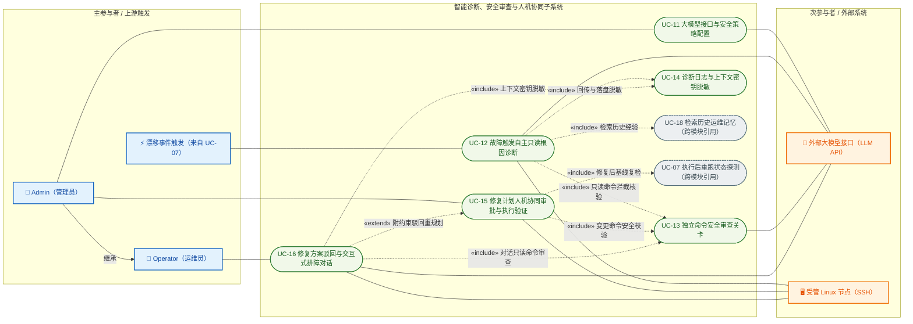

```mermaid
flowchart LR
    subgraph SG_P2["主参与者 / 上游触发"]
        direction TB
        Admin["👤 Admin（管理员）"]
        Operator["👤 Operator（运维员）"]
        DriftEvt["⚡ 漂移事件触发（来自 UC-07）"]

        Admin -->|"继承"| Operator
    end

    subgraph SG_S2["智能诊断、安全审查与人机协同子系统"]
        direction TB
        UC11(["UC-11 大模型接口与安全策略配置"])
        UC12(["UC-12 故障触发自主只读根因诊断"])
        UC13(["UC-13 独立命令安全审查关卡"])
        UC14(["UC-14 诊断日志与上下文密钥脱敏"])
        UC15(["UC-15 修复计划人机协同审批与执行验证"])
        UC16(["UC-16 修复方案驳回与交互式排障对话"])
        UC18Ref(["UC-18 检索历史运维记忆（跨模块引用）"])
        UC07Ref(["UC-07 执行后重跑状态探测（跨模块引用）"])
    end

    subgraph SG_E2["次参与者 / 外部系统"]
        direction TB
        LLMAPI["🤖 外部大模型接口（LLM API）"]
        SSHNode["🖥️ 受管 Linux 节点（SSH）"]
    end

    %% 主参与者关联
    Admin --- UC11
    Admin --- UC15
    Operator --- UC16
    DriftEvt --- UC12

    %% 用例间关系
    UC12 -.->|"«include» 检索历史经验"| UC18Ref
    UC12 -.->|"«include» 只读命令拦截核验"| UC13
    UC12 -.->|"«include» 回传与落盘脱敏"| UC14

    UC15 -.->|"«include» 变更命令安全校验"| UC13
    UC15 -.->|"«include» 修复后基线复检"| UC07Ref

    UC16 -.->|"«extend» 附约束驳回重规划"| UC15
    UC16 -.->|"«include» 对话只读命令审查"| UC13
    UC16 -.->|"«include» 上下文密钥脱敏"| UC14

    %% 次参与者关联
    UC11 --- LLMAPI
    UC12 --- LLMAPI
    UC12 --- SSHNode
    UC13 --- LLMAPI
    UC15 --- SSHNode
    UC16 --- LLMAPI
    UC16 --- SSHNode

    classDef primaryActor fill:#E3F2FD,stroke:#1565C0,stroke-width:2px,color:#0D47A1
    classDef secondaryActor fill:#FFF3E0,stroke:#EF6C00,stroke-width:2px,color:#E65100
    classDef usecase fill:#F1F8E9,stroke:#2E7D32,stroke-width:1.5px,color:#1B5E20
    classDef refUsecase fill:#ECEFF1,stroke:#546E7A,stroke-width:1.5px,stroke-dasharray: 4 2,color:#37474F

    class Admin,Operator,DriftEvt primaryActor
    class LLMAPI,SSHNode secondaryActor
    class UC11,UC12,UC13,UC14,UC15,UC16 usecase
    class UC18Ref,UC07Ref refUsecase
```
