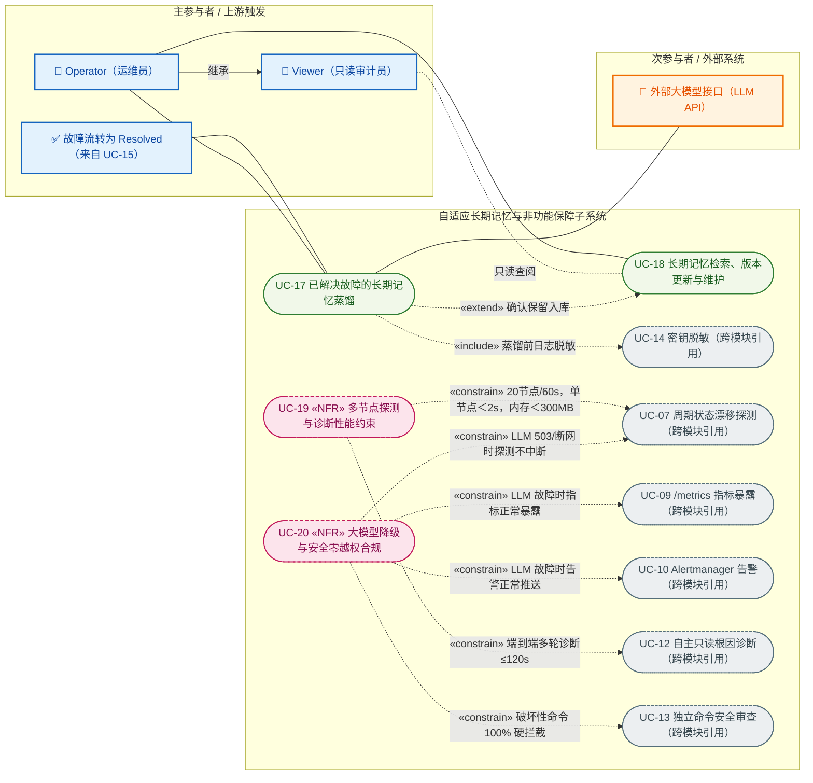

```mermaid
flowchart LR
    subgraph SG_P3["主参与者 / 上游触发"]
        direction TB
        Operator["👤 Operator（运维员）"]
        Viewer["👤 Viewer（只读审计员）"]
        ResolvedEvt["✅ 故障流转为 Resolved（来自 UC-15）"]

        Operator -->|"继承"| Viewer
    end

    subgraph SG_S3["自适应长期记忆与非功能保障子系统"]
        direction TB
        UC17(["UC-17 已解决故障的长期记忆蒸馏"])
        UC18(["UC-18 长期记忆检索、版本更新与维护"])
        UC19(["UC-19 «NFR» 多节点探测与诊断性能约束"])
        UC20(["UC-20 «NFR» 大模型降级与安全零越权合规"])

        UC14Ref(["UC-14 密钥脱敏（跨模块引用）"])
        UC07Ref(["UC-07 周期状态漂移探测（跨模块引用）"])
        UC09Ref(["UC-09 /metrics 指标暴露（跨模块引用）"])
        UC10Ref(["UC-10 Alertmanager 告警（跨模块引用）"])
        UC12Ref(["UC-12 自主只读根因诊断（跨模块引用）"])
        UC13Ref(["UC-13 独立命令安全审查（跨模块引用）"])
    end

    subgraph SG_E3["次参与者 / 外部系统"]
        direction TB
        LLMAPI["🤖 外部大模型接口（LLM API）"]
    end

    %% 主参与者关联
    ResolvedEvt --- UC17
    Operator --- UC17
    Operator --- UC18
    Viewer -.-|"只读查阅"| UC18

    %% 记忆模块用例关系
    UC17 -.->|"«include» 蒸馏前日志脱敏"| UC14Ref
    UC17 -.->|"«extend» 确认保留入库"| UC18

    %% 非功能需求约束关系
    UC19 -.->|"«constrain» 20节点/60s，单节点＜2s，内存＜300MB"| UC07Ref
    UC19 -.->|"«constrain» 端到端多轮诊断≤120s"| UC12Ref

    UC20 -.->|"«constrain» LLM 503/断网时探测不中断"| UC07Ref
    UC20 -.->|"«constrain» LLM 故障时指标正常暴露"| UC09Ref
    UC20 -.->|"«constrain» LLM 故障时告警正常推送"| UC10Ref
    UC20 -.->|"«constrain» 破坏性命令 100% 硬拦截"| UC13Ref

    %% 次参与者关联
    UC17 --- LLMAPI

    classDef primaryActor fill:#E3F2FD,stroke:#1565C0,stroke-width:2px,color:#0D47A1
    classDef secondaryActor fill:#FFF3E0,stroke:#EF6C00,stroke-width:2px,color:#E65100
    classDef usecase fill:#F1F8E9,stroke:#2E7D32,stroke-width:1.5px,color:#1B5E20
    classDef nfrUsecase fill:#FCE4EC,stroke:#C2185B,stroke-width:1.5px,stroke-dasharray: 5 3,color:#880E4F
    classDef refUsecase fill:#ECEFF1,stroke:#546E7A,stroke-width:1.5px,stroke-dasharray: 4 2,color:#37474F

    class Operator,Viewer,ResolvedEvt primaryActor
    class LLMAPI secondaryActor
    class UC17,UC18 usecase
    class UC19,UC20 nfrUsecase
    class UC14Ref,UC07Ref,UC09Ref,UC10Ref,UC12Ref,UC13Ref refUsecase
```
