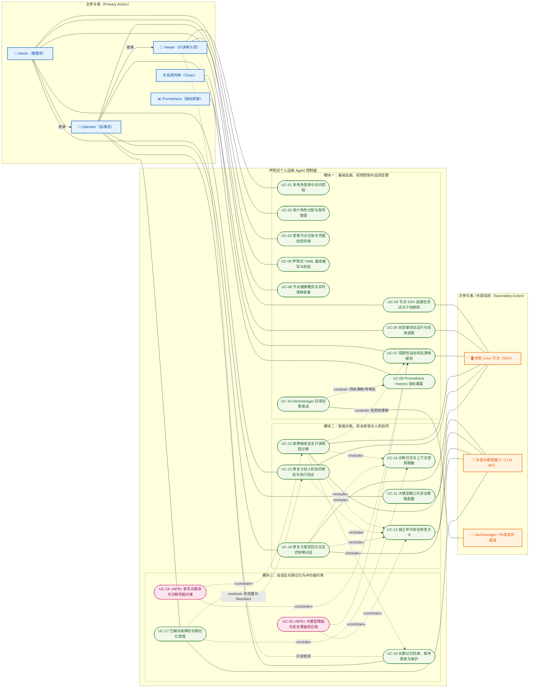

```mermaid
flowchart LR
    %% ==================== 左侧：主参与者 ====================
    subgraph SG_Primary["主参与者（Primary Actors）"]
        direction TB
        Admin["👤 Admin（管理员）"]
        Operator["👤 Operator（运维员）"]
        Viewer["👤 Viewer（只读审计员）"]
        Timer["⏰ 系统时钟（Timer）"]
        PromIn["📊 Prometheus（指标抓取）"]

        Admin -->|"继承"| Operator
        Operator -->|"继承"| Viewer
    end

    %% ==================== 中间：系统边界 ====================
    subgraph SG_System["声明式个人运维 Agent 控制面"]
        direction LR

        subgraph SG_Mod1["模块一：基础设施、权限控制与监控告警"]
            direction TB
            UC01(["UC-01 多角色登录与访问控制"])
            UC02(["UC-02 用户角色分配与账号管理"])
            UC03(["UC-03 受管节点注册与凭据加密存储"])
            UC04(["UC-04 节点 SSH 连通性测试与下线移除"])
            UC05(["UC-05 声明式 YAML 基线编写与校验"])
            UC06(["UC-06 状态基线试运行与启用调度"])
            UC07(["UC-07 周期性自动状态漂移探测"])
            UC08(["UC-08 节点健康概览与实时漂移查看"])
            UC09(["UC-09 Prometheus /metrics 指标暴露"])
            UC10(["UC-10 Alertmanager 异常告警推送"])
        end

        subgraph SG_Mod2["模块二：智能诊断、安全审查与人机协同"]
            direction TB
            UC11(["UC-11 大模型接口与安全策略配置"])
            UC12(["UC-12 故障触发自主只读根因诊断"])
            UC13(["UC-13 独立命令安全审查关卡"])
            UC14(["UC-14 诊断日志与上下文密钥脱敏"])
            UC15(["UC-15 修复计划人机协同审批与执行验证"])
            UC16(["UC-16 修复方案驳回与交互式排障对话"])
        end

        subgraph SG_Mod3["模块三：自适应长期记忆与非功能约束"]
            direction TB
            UC17(["UC-17 已解决故障的长期记忆蒸馏"])
            UC18(["UC-18 长期记忆检索、版本更新与维护"])
            UC19(["UC-19 «NFR» 多节点探测与诊断性能约束"])
            UC20(["UC-20 «NFR» 大模型降级与安全零越权合规"])
        end
    end

    %% ==================== 右侧：次参与者 / 外部系统 ====================
    subgraph SG_Secondary["次参与者 / 外部系统（Secondary Actors）"]
        direction TB
        SSHNode["🖥️ 受管 Linux 节点（SSH）"]
        LLMAPI["🤖 外部大模型接口（LLM API）"]
        AlertCh["🔔 Alertmanager / 外部消息通道"]
    end

    %% ==================== 主参与者 -> 用例 ====================
    Viewer --- UC01
    Viewer --- UC08
    Viewer -.-|"只读查阅"| UC18

    Operator --- UC05
    Operator --- UC06
    Operator --- UC16
    Operator --- UC17
    Operator --- UC18

    Admin --- UC02
    Admin --- UC03
    Admin --- UC04
    Admin --- UC11
    Admin --- UC15

    Timer --- UC07
    PromIn --- UC09

    %% ==================== 用例间核心关系 ====================
    UC12 -.->|"«extend» 检测到漂移"| UC07
    UC12 -.->|"«include»"| UC13
    UC12 -.->|"«include»"| UC14
    UC12 -.->|"«include»"| UC18
    UC15 -.->|"«include»"| UC13
    UC16 -.->|"«include»"| UC13
    UC16 -.->|"«include»"| UC14
    UC17 -.->|"«extend» 状态置为 Resolved"| UC15
    UC17 -.->|"«include»"| UC14
    UC10 -.->|"«extend» 持续漂移/待审批"| UC09

    %% ==================== 非功能需求约束 ====================
    UC19 -.->|"«constrain»"| UC07
    UC19 -.->|"«constrain»"| UC12
    UC20 -.->|"«constrain»"| UC07
    UC20 -.->|"«constrain»"| UC13

    %% ==================== 用例 -> 次参与者 ====================
    UC04 --- SSHNode
    UC06 --- SSHNode
    UC07 --- SSHNode
    UC12 --- SSHNode
    UC15 --- SSHNode
    UC16 --- SSHNode

    UC11 --- LLMAPI
    UC12 --- LLMAPI
    UC13 --- LLMAPI
    UC16 --- LLMAPI
    UC17 --- LLMAPI

    UC10 --- AlertCh

    %% ==================== 样式定义 ====================
    classDef primaryActor fill:#E3F2FD,stroke:#1565C0,stroke-width:2px,color:#0D47A1
    classDef secondaryActor fill:#FFF3E0,stroke:#EF6C00,stroke-width:2px,color:#E65100
    classDef usecase fill:#F1F8E9,stroke:#2E7D32,stroke-width:1.5px,color:#1B5E20
    classDef nfrUsecase fill:#FCE4EC,stroke:#C2185B,stroke-width:1.5px,stroke-dasharray: 5 3,color:#880E4F

    class Admin,Operator,Viewer,Timer,PromIn primaryActor
    class SSHNode,LLMAPI,AlertCh secondaryActor
    class UC01,UC02,UC03,UC04,UC05,UC06,UC07,UC08,UC09,UC10,UC11,UC12,UC13,UC14,UC15,UC16,UC17,UC18 usecase
    class UC19,UC20 nfrUsecase
```
